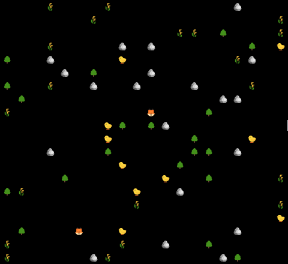

# Симуляция

Консолное приложение на Java.
Реализация симуляции животного мира в ООП стиле.

Суть проекта — пошаговая симуляция 2D-мира, населенного травоядными и хищниками.  
Помимо существ, мир содержит ресурсы (траву), которыми питаются травоядные, и статичные объекты (деревья и камни), с которыми нельзя взаимодействовать — они просто заполняют пространство.

Реализованные функции:  
Действия существ - травоядные могут либо идти к траве, либо есть ее; хищники могут либо идти к травоядным, либо есть их. Если не остаётся ни одного травоядного на поле, симуляция завершается.  
Травоядное пополняет здоровье на 1 hp, поедаю траву, но не более его максимального здоровья.  
В качестве алгоритма поиска пути используется **поиск в ширину (BFS)**. Алгоритм исключает статичные объекты (деревья и камни) из поиска пути.  
Каждые полсекунды в консоль рендерится ход всех существ. Нажатием клавиши Enter можно приостановить симуляцию. Повторное нажатие возобновляет её.
